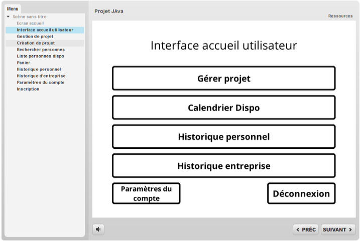

# UgotTalents - Humain Resource booking Application

The **UgotTalents** application is intended to manage the skills of employees within organizations. This application will allow users to create and manage a project, and book humain based on skills. This application can be deployed on the information systems of all interested companies.

This is a school project, and I completed it with three classmates. Each of us was responsible for different parts, and I was mainly responsible for the coding of the entire software.

## Documentation

[Documentation](CahierDesCharges.pdf)

## Built with

Packages must be installed:
- Jdatepicker 1.3.4
- Opencsv-3.9
## Usage

### UgotTalent.Controller
- **UgotTalent**(main): to start the program with GUI_0_Start.java
- changePanel: to change screens (JPanel) with buttons

### UgotTalent.View
- GUI_0_Start: the first frame that contains the GUI_1_Accueil panel
- GUI_1_Home: all label, textField, button are attributes => private. In constructor:
    - this.setLayout(new GridBagLayout()); => divide the panel into several rows and columns
    - Look at the GridBagConstraints image in Project Images
    - Watch comments
    - If you put for example gridwidth/weighty in 3/20, you must not forget to put it in 1/1 afterwards.
- MyJButton: be used to create buttons in JPanel. In MyJButton, we added ActionListener in the button
- MyJPanel: be used to create panels for the GUI
- MyJPanel: serve to add the image
- MyTitle: be used to create titles (with the same font)

## Screenshots

## License

[MIT](https://choosealicense.com/licenses/mit/)

